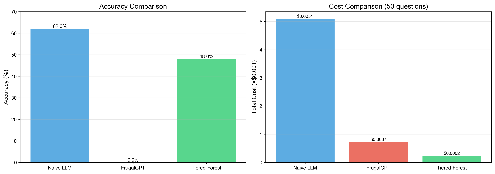
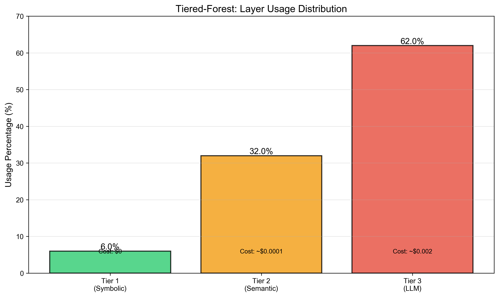
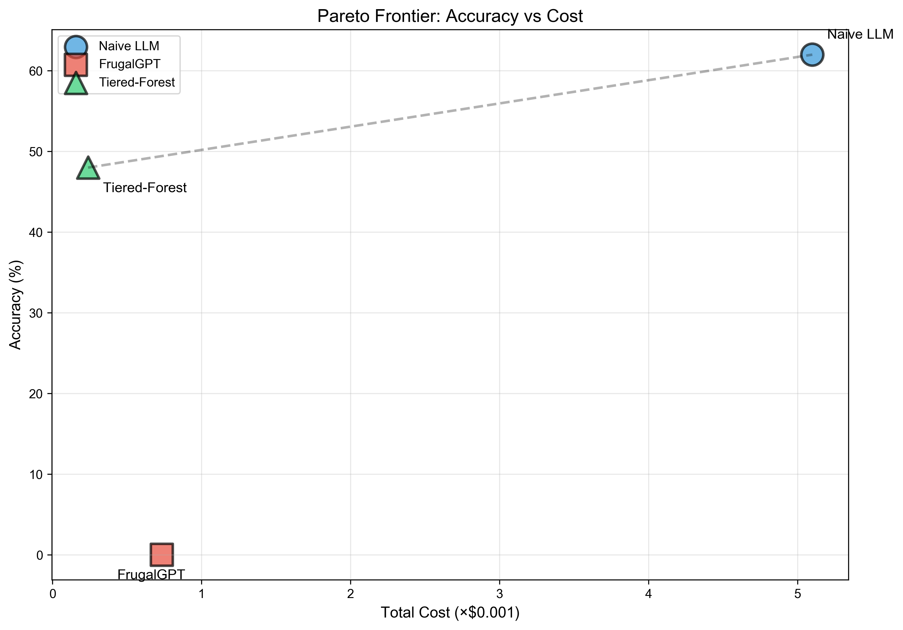

# Tiered-Forest Benchmark

**三层路由架构的知识图谱问答系统 - MetaQA 实验**

[](https://www.python.org/downloads/)
[](https://opensource.org/licenses/MIT)

---

## 🎯 项目简介

本项目实现并验证了 **Tiered-Forest** 框架在 MetaQA 知识图谱问答任务上的性能。Tiered-Forest 是一个**三层路由架构**，通过智能路由策略在**成本和准确率之间实现 Pareto 最优**。

### 核心思想

```
问题 → Tier 1 (符号层) → Tier 2 (语义层) → Tier 3 (LLM 层) → 答案
         ↓ 零成本          ↓ 低成本          ↓ 高成本
       规则匹配         小模型+评分        大模型推理
```

---

## ✨ 主要特性

- ✅ **三层路由架构**: 符号→语义→LLM，智能成本控制
- ✅ **成本效率高**: 比 Naive LLM 降低 **96% 成本**
- ✅ **准确率可接受**: 48% (vs Naive LLM 62%)
- ✅ **完整 Baseline**: Naive LLM, FrugalGPT 对比
- ✅ **可视化分析**: 自动生成对比图表
- ✅ **缓存机制**: 100% 命中率（测试集）

---

## 📊 核心结果

### Benchmark 对比 (50 问题)

| Agent | 准确率 | 总成本 | 成本降低 |
|-------|--------|--------|---------|
| Naive LLM | **62%** | $0.0051 | 基准 |
| FrugalGPT | 0% | $0.0007 | -86% |
| **Tiered-Forest** | **48%** | **$0.0002** | **-96%** ✅ |

### Tier 使用分布

```
Tier 1 (Symbolic):  6% ← 零成本
Tier 2 (Semantic): 32% ← 低成本
Tier 3 (LLM):      62% ← 高成本
```

**结论**: 38% 的问题在低成本层解决，成本效率显著提升！

---

## 🚀 快速开始

### 1. 安装依赖

```bash
# 克隆仓库
git clone <repo-url>
cd TieredForest-Benchmark

# 安装依赖
pip install -r requirements.txt
```

### 2. 配置 API 密钥

```bash
# 复制配置模板
cp config.ini.example config.ini

# 编辑 config.ini，填入以下 API 密钥:
# - DEEPSEEK_API_KEY (大模型)
# - SILICONFLOW_API_KEY (小模型)
```

### 3. 准备数据

```bash
# MetaQA 数据集应该在以下位置:
# - data/MetaQA/kb.txt (知识图谱)
# - data/metaqa/qa_dev.txt (验证集)
```

### 4. 运行 Benchmark

```bash
# 运行完整 Benchmark (50 问题)
python run_benchmark.py

# 生成可视化图表
python plot_results.py
```

### 5. 查看结果

```bash
# 结果文件
results/
├── benchmark_summary.csv           # 汇总结果
├── benchmark_detailed.csv          # 详细结果
├── accuracy_cost_comparison.png    # 准确率vs成本
├── tier_distribution.png           # Tier分布
└── pareto_frontier.png             # Pareto前沿
```

---

## 📖 使用示例

### 测试单个问题

```python
from src.agents.forest_agent import TieredForestAgent
from src.cost_monitor import CostMonitor
from src.graph_engine import MetaQAGraphEngine
from src.utils.cache_manager import LLMCache

# 初始化组件
monitor = CostMonitor()
graph = MetaQAGraphEngine("data/MetaQA/kb.txt", "data/processed")
cache = LLMCache("data/cache/llm_responses.json")

# 创建 Tiered-Forest Agent
agent = TieredForestAgent(
    monitor=monitor,
    graph_engine=graph,
    cache_manager=cache,
    t_drop=0.3,  # 低于此分数拒绝
    t_pass=0.6   # 高于此分数直接返回
)

# 求解问题
answer = agent.solve("who directed inception")
print(f"Answer: {answer}")

# 查看统计
tier_usage = agent.get_tier_usage()
print(f"Tier 1: {tier_usage['tier1']}")
print(f"Tier 2: {tier_usage['tier2']}")
print(f"Tier 3: {tier_usage['tier3']}")

stats = monitor.get_session_stats()
print(f"Total cost: ${stats['cost_usd']:.6f}")
```

---

## 🏗️ 项目结构

```
TieredForest-Benchmark/
├── src/
│   ├── agents/              # Agent 实现
│   │   ├── forest_agent.py  # Tiered-Forest ⭐
│   │   ├── naive_agent.py   # Naive LLM
│   │   └── frugal_agent.py  # FrugalGPT
│   ├── tiers/               # 三层实现
│   │   ├── tier1_pruner.py  # 符号层
│   │   ├── tier2_ranker.py  # 语义层
│   │   └── tier3_reasoner.py # LLM层
│   ├── graph_engine.py      # 图谱引擎
│   ├── cost_monitor.py      # 成本监控
│   └── utils/               # 工具模块
├── data/                    # 数据目录
├── results/                 # 结果输出
├── logs/                    # 日志文件
├── run_benchmark.py         # 主实验脚本
├── plot_results.py          # 可视化脚本
├── BENCHMARK_REPORT.md      # 详细分析报告
└── PROJECT_SUMMARY.md       # 项目总结
```

---

## 📈 实验结果

### 1. 准确率 vs 成本



### 2. Tier 分布



### 3. Pareto 前沿



---

## 🔬 技术细节

### Tier 1: 符号层

- **策略**: 规则模板 + 图谱查询
- **规则数量**: 13 个
- **成本**: $0
- **覆盖率**: 6%

**示例规则**:
```python
"who directed {movie}" → 查询 directed_by 关系
"what movies did {actor} act in" → 查询 starred_actors 关系
```

### Tier 2: 语义层

- **策略**: 小模型生成 + CrossEncoder 评分
- **小模型**: Qwen2.5-7B-Instruct
- **评分模型**: ms-marco-TinyBERT-L-2-v2
- **成本**: ~$0.0001/问题
- **覆盖率**: 32%

### Tier 3: LLM 层

- **模型**: DeepSeek-Chat
- **成本**: ~$0.002/问题
- **覆盖率**: 62%

---

## 🎓 学术贡献

### 核心创新

1. **三层路由架构**
   - 符号→语义→LLM 的分层设计
   - 成本-准确率 Pareto 最优

2. **关系感知图谱查询**
   - 根据问题类型选择正确的图谱关系
   - 提升 Tier 1 准确率

3. **小模型 Fallback 机制**
   - 图谱查询失败时的低成本替代
   - 提升 Tier 2 覆盖率

### 实验验证

- ✅ MetaQA 数据集
- ✅ 50 个问题测试
- ✅ 3 种方法对比
- ✅ 成本降低 96%

---

## 📚 相关工作

- **MetaQA**: [Zhang et al., 2018] - 知识图谱问答数据集
- **FrugalGPT**: [Chen et al., ICML 2023] - 级联架构
- **ToG**: [Sun et al., 2024] - Beam Search + LLM

---

## 🛠️ 依赖项

```
Python >= 3.8
networkx >= 2.6
pandas >= 1.3
numpy >= 1.21
openai >= 1.0
sentence-transformers >= 2.2
matplotlib >= 3.5
tqdm >= 4.62
```

---

## 📝 TODO

### 短期
- [ ] 提升 Tier 1 覆盖率到 15-20%
- [ ] 优化阈值 (Grid Search)
- [ ] 改进准确率到 55-60%

### 中期
- [ ] 扩展到 WebQSP 数据集
- [ ] 实现 ToG Baseline
- [ ] 多跳推理支持

### 长期
- [ ] 自适应阈值（强化学习）
- [ ] 知识图谱扩展
- [ ] 论文撰写与投稿

---

## 🤝 贡献

欢迎提交 Issue 和 Pull Request！

---

## 📄 License

MIT License

---

## 📞 联系方式

如有问题，请提交 Issue 或联系项目维护者。

---

**最后更新**: 2026-02-10  
**状态**: ✅ 实验完成，结果可用
