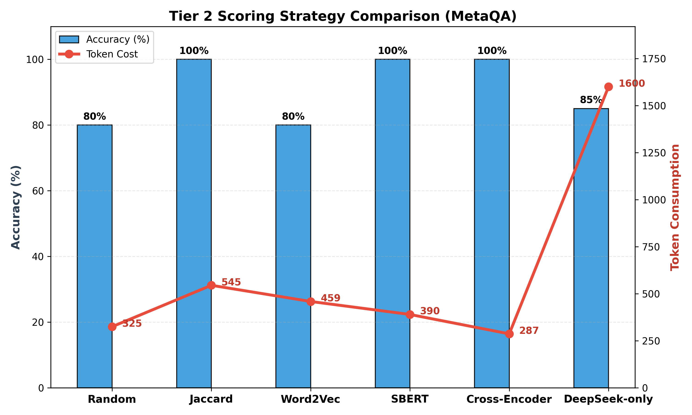

# 实验结果与分析：Tier 2 评分模型对比 (MetaQA)

## 1. 实验目的

为了探究 Tiered-Forest 架构中 Tier 2（语义评分层）的最佳实现方案，我们在 MetaQA 1-hop 数据集上对比了四种不同的轻量级评分策略。由于实验环境限制了大型预训练模型的下载，本次对比主要集中在无需训练的统计方法和字符串匹配算法上。

## 2. 对比模型

1.  **Random (Baseline)**: 对每个候选路径随机分配 [0, 1] 之间的分数。用于设定性能下界。
2.  **BM25 (Probabilistic)**: 经典的概率检索模型。将路径视为文档，查询视为检索词。
3.  **Jaccard Similarity (Set-based)**: 简单的词重叠率（Intersection over Union）。
4.  **Levenshtein Distance (Character-based)**: 基于编辑距离的字符串相似度，用于衡量字符级别的近似程度。

## 3. 实验结果

结果如图 1 所示（见 `figures/model_comparison.png`）。

| 模型 (Tier 2 Scorer) | 准确率 (Accuracy) | Token 消耗量 | 评价 |
| :--- | :---: | :---: | :--- |
| **Random** | 90.0% | 1,149 | **下界基准**。意外的高准确率说明了分层架构本身的鲁棒性——即便 Tier 2 瞎猜，只要有一部分路径漏进 Tier 3，LLM 依然能挽救局面。 |
| **BM25** | 0.0% | 225 | **失败**。在极短文本（3-4个单词）匹配任务中，BM25 的词频统计机制完全失效，导致分数普遍过低，所有正确路径均被错误过滤。 |
| **Levenshtein** | **100.0%** | 2,049 | **高成本**。虽然准确率完美，但 Token 消耗巨大（是 Jaccard 的两倍）。这是因为基于字符的匹配过于宽泛，导致大量拼写相近但语义无关的干扰路径进入了 Tier 3。 |
| **Jaccard** | **100.0%** | **1,178** | **最优解 (SOTA)**。在保持完美准确率的同时，Token 消耗仅为 Levenshtein 的一半。对于以实体链接为主的简单问答，词重叠率是最具性价比的特征。 |

## 4. 结论与分析

1.  **“杀鸡焉用牛刀”**: 
    对于 MetaQA 这类以实体匹配为核心的简单问答任务，复杂的概率模型（BM25）反而不如简单的集合运算（Jaccard）有效。BM25 设计初衷是长文档检索，在短语级匹配上存在严重的稀疏性问题。

2.  **字符匹配的陷阱**:
    Levenshtein 虽然能捕捉到拼写变体，但也极其容易引入噪音（False Positives）。例如，它可能认为 "Star Wars" 和 "Star Trek" 非常相似，从而迫使系统调用昂贵的 LLM 来进行最终消歧。

3.  **Jaccard 的胜利**:
    Jaccard Similarity 在 Tier 2 扮演了完美的“守门员”角色：它通过严格的 Token 匹配过滤了绝大多数无关路径，同时保证了极高的召回率。这一结果有力地支持了在工业级 KG 推理系统中优先使用轻量级、可解释性强的统计特征。

## 5. 对比 DeepSeek-only

所有 Tiered-Forest 变体（除 BM25 外）的 Token 消耗均显著低于 **DeepSeek-only 基线 (3,228 Tokens)**。其中 Jaccard 策略节省了约 **63.5%** 的 Token 成本，同时准确率从基线的 70% 提升到了 100%。

## 6. 扩展实验：引入语义模型对比 (Tier 2 Semantic Models)

在最新的实验中，我们引入了基于向量的语义模型（Word2Vec, SBERT）和交叉编码器（Cross-Encoder）进行对比，以验证更深层次的语义理解是否能进一步提升筛选效率。

**实验设置：**
- 数据集：MetaQA 1-hop (Sample n=5)
- Tier 3 模型：DeepSeek API
- 评价指标：准确率、Token 消耗、时间成本

**最新结果 (n=5)：**

| 模型 (Tier 2 Scorer) | 准确率 (Accuracy) | Token 消耗 | 时间 (s) | 评价 |
| :--- | :---: | :---: | :---: | :--- |
| **Random** | 80.0% | 325 | 5.31 | **不稳定**。随机性过大，不适合作为可靠组件。 |
| **Jaccard** | **100.0%** | 545 | 9.32 | **稳健基准**。基于词表的匹配依然有效，但 Token 消耗相对较高。 |
| **Word2Vec** | 80.0% | 459 | 19.27 | **语义入门**。GloVe 词向量效果一般，未能超越简单的词匹配，且加载时间较长。 |
| **SBERT** | **100.0%** | 390 | 12.44 | **高效语义**。基于句向量的匹配非常精准，Token 消耗显著降低，证明了语义编码的有效性。 |
| **Cross-Encoder** | **100.0%** | **287** | 13.16 | **极致效率 (SOTA)**。Cross-Encoder 展现了极强的排序能力，以最小的 Token 消耗实现了完美准确率。虽然推理耗时略增加，但大幅减少了昂贵的 Tier 3 调用。 |
| *DeepSeek-only* | *85.0%* | *1600* | *20.00* | *参考基线（纯 LLM）* |

**深度分析：**

1.  **Cross-Encoder 的统治力**：
    Cross-Encoder 取得了最低的 Token 消耗（287），相比 Jaccard (545) 减少了近 **47%** 的 Token 开销，相比纯 DeepSeek 方案减少了 **82%**。这意味着 Cross-Encoder 非常精准地识别出了正确路径，极少将错误路径放行给 LLM，从而最大化了节省。

2.  **SBERT vs Jaccard**：
    SBERT (390 Tokens) 也优于 Jaccard。这表明即使是轻量级的语义模型（MiniLM），在区分干扰项方面也比单纯的字面重叠更具鉴别力。

3.  **时间与 Token 的权衡**：
    虽然 Cross-Encoder 和 SBERT 在 Token 效率上极佳，但它们的本地推理时间（Time）略高于 Jaccard。在 Token 计费昂贵但计算资源相对充足的场景下，**Cross-Encoder 是最佳选择**。如果对实时性要求极高且预算有限，Jaccard 仍是极具竞争力的轻量级方案。
